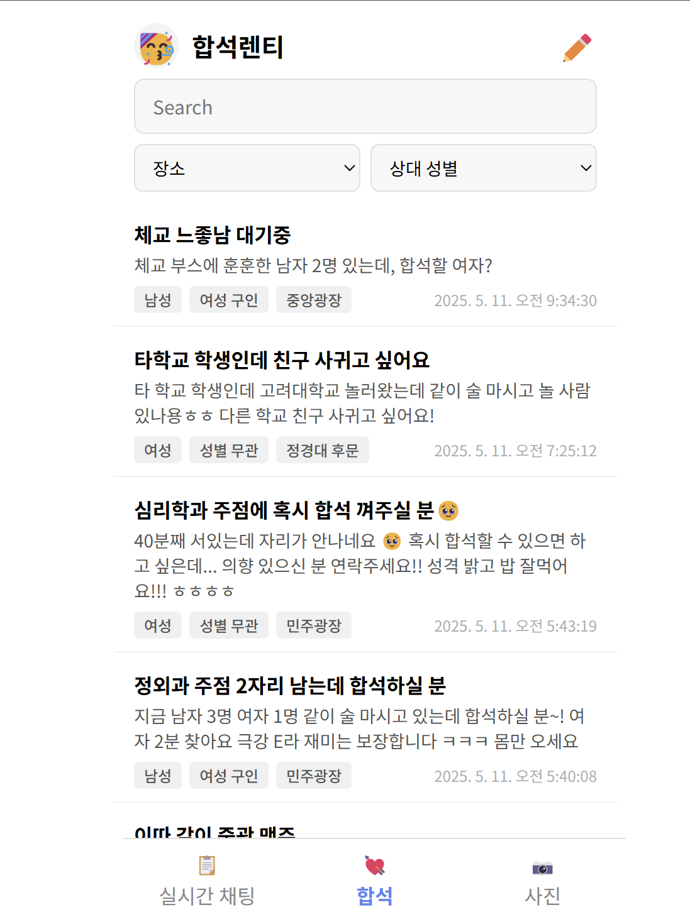
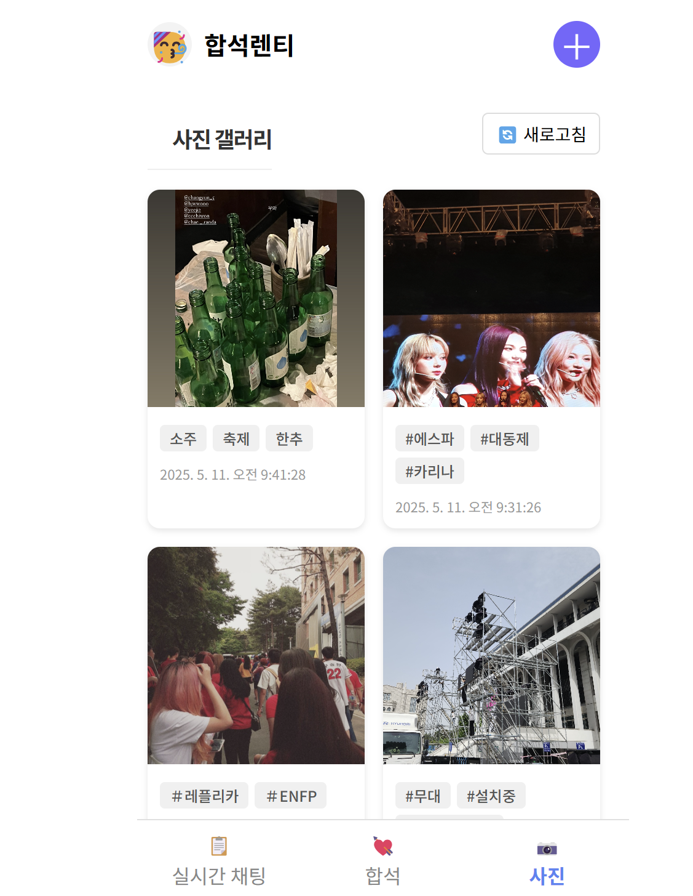

# 🎉 합석렌티

합석렌티의 레포지토리입니다.  
입실렌티 축제를 더욱 즐겁게 만들어 줄 동행 매칭 & 실시간 소통 앱입니다.

 

  

---

## 🚩 프로젝트 소개 : 합석렌티

### 🧾 서비스 개요  
합석렌티는 입실렌티에서 **실시간 만남과 소통**을 지원하는 앱입니다.  
혼자 온 참가자들도 함께 어울리며 축제를 더욱 풍성하게 즐길 수 있도록 돕습니다.

### 🛠 주요 기능  
- **실시간 채팅** : 축제 현장에서 실시간 반응 공유 및 소통  
- **합석 모집** : 게시글로 동행자 찾기  
- **사진 공유** : 축제의 순간을 기록하고 나누는 갤러리  

---

## 📑 목차  
1. [프로젝트 개요](#orange_book-프로젝트-개요)  
2. [팀원 구성](#four_leaf_clover-팀원-구성)  
3. [기능 소개](#-기능-소개)

---

## :orange_book: 프로젝트 개요  

### 💡 합석렌티 소개  
합석렌티는 축제를 더욱 생생하게 즐길 수 있도록 돕는 **축제 동행 매칭 플랫폼**입니다.

> 🎈 혼자 가기 망설여졌던 사람들  
> 🤝 새로운 인연과의 만남  
> 📸 추억을 기록하고 나누는 공간  

---

### 📌 기능 설명

#### ✅ 실시간 채팅  
현장 반응을 실시간으로 확인하고, 축제 공간에 있는 사람들과 채팅을 통해 즉각적으로 교류할 수 있습니다.

#### ✅ 합석 기능  
게시글을 작성해 동행자를 모집하거나, 관심사 기반의 그룹을 형성할 수 있어 새로운 만남의 장을 마련합니다.

#### ✅ 사진 공유  
즐거운 순간을 사진으로 남기고 다른 참가자들과 공유하며, 함께 만든 추억을 기록할 수 있습니다.

> 합석렌티는 단순한 채팅 앱이 아닙니다.  
> **사람과 사람을 이어주고, 낯선 축제를 특별한 경험으로 바꾸는 서비스**입니다.

---

## 🍀 팀원 구성  

| 김윤정 [@buskerberserker](https://github.com/buskerberserker) | 이준수 [@junsulee20](https://github.com/junsulee20) | 홍지우 [@jeewoo0701](https://github.com/jeewoo0701) | 함형주 [@xzhhj01](https://github.com/xzhhj01) |
|:--:|:--:|:--:|:--:|
|  |  |  |  |
| FE / 기획 | FE / 기획 | BE / FE | BE / FE |
| FE, UI/UX, 기획 | FE, UI/UX, 기획 | 백엔드 세팅, FE | 프로젝트 세팅, 관리 |

---

## 🧩 기능 소개  

### 🪑 1. 합석 기능

  

### 💬 2. 실시간 채팅

  

### 🖼️ 3. 갤러리 (사진 공유)

  

---

